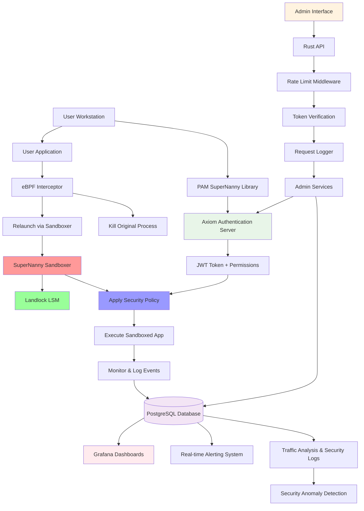
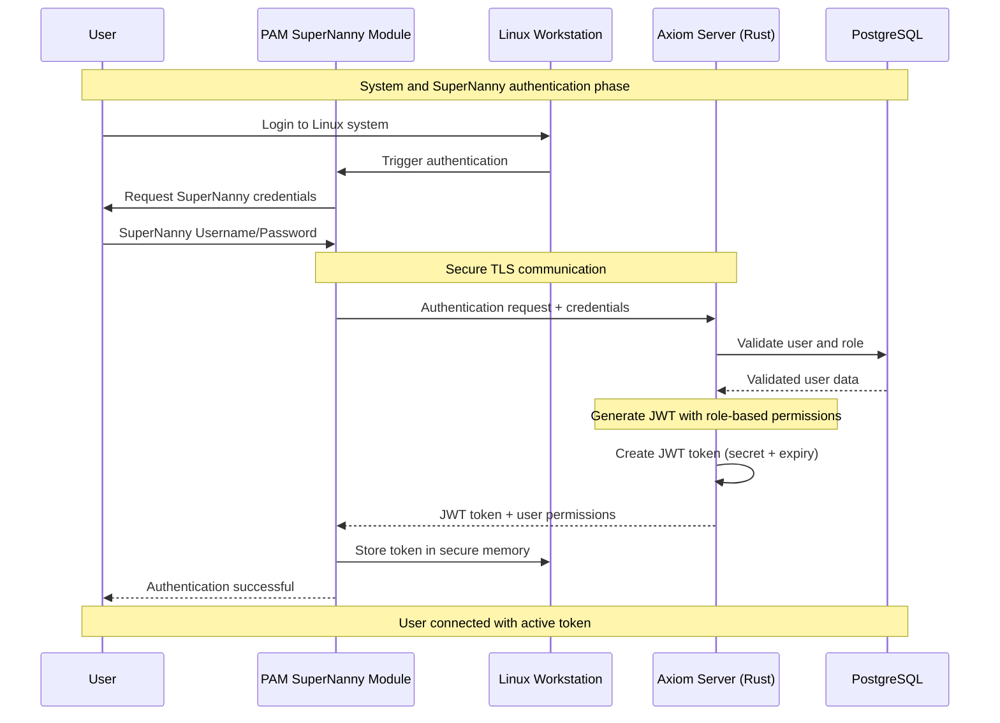
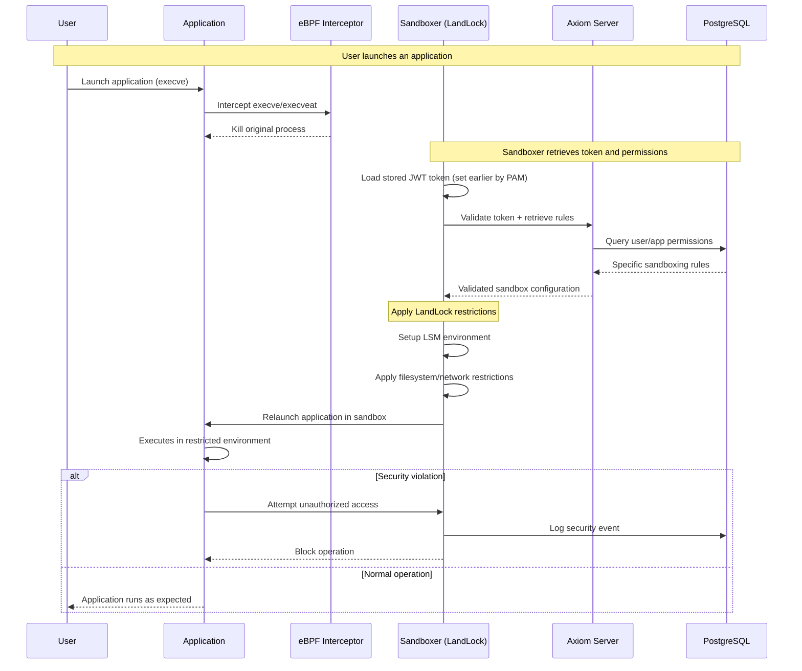
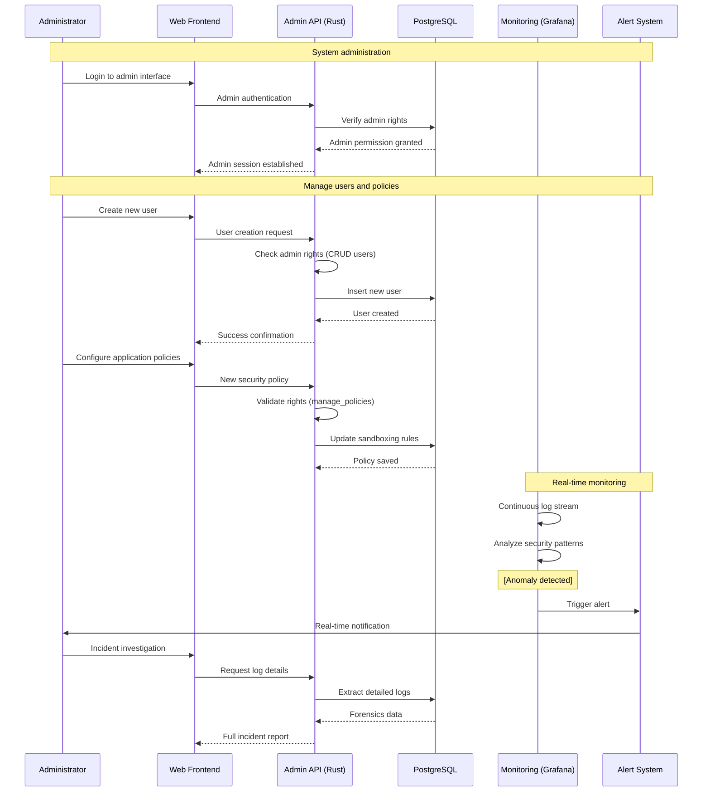

# SuperNanny


> **Advanced Sandboxing System for Linux Workstations**

A cybersecurity project developed by the ISEN Méditerranée team as part of the Master Project M1 Cybersecurity.


## Development Team

- **CATALA Alexandre**
- **CAILLEAUX Tanguy** 
- **MATILLA-NORO Lorenzo**
- **VERNANCHET Louis**

## Project Overview

SuperNanny is an innovative security solution designed to protect Linux workstations by automatically sandboxing all applications launched by users. The system implements a secure three-tier architecture with centralized authentication, Role-Based Access Control (RBAC), and real-time monitoring.

### Key Objectives

- **Proactive Security**: Automatic sandboxing of all user applications
- **Granular Control**: Fine-grained permission management by role and application
- **Advanced Monitoring**: Real-time surveillance with automated alerting
- **Secure Architecture**: Clear separation between data access layers

## System Architecture



## Technical Components

### User Workstation Side

#### 1. **PAM SuperNanny Library**
The PAM (Pluggable Authentication Modules) SuperNanny library seamlessly integrates into the standard Linux authentication flow. When users authenticate on their Linux system, they simultaneously authenticate with the SuperNanny server to retrieve their JWT token with associated permissions. These tokens are subsequently used by the sandboxer to apply security rules on processes executed by the user.

**Key Features:**
- Transparent integration with existing Linux authentication
- Secure credential management
- Automatic token retrieval and caching
- Seamless user experience

#### 2. **eBPF Interceptor**
The eBPF interceptor module captures all `execve` and `execveat` system calls in real-time. Upon detection, it immediately terminates the launched process and relaunches it in "sandboxed" mode using the sandboxer binary. This approach ensures that no application can execute outside the controlled environment.

**Technical Implementation:**
- Kernel-level interception using eBPF programs
- Zero-latency process termination
- Automatic relaunch mechanism
- Minimal system performance impact

#### 3. **Landlock Sandboxer**
The sandboxer, built using the Landlock LSM (Linux Security Module), ensures that applications run within a strictly defined sandboxed environment. Each process is confined and executes with specifically defined and granted rights. Any security violations are automatically logged to the database.

**Security Features:**
- Complete process isolation
- Granular permission enforcement
- File system access control
- Network access restrictions
- Comprehensive violation logging

### Axiom Server (3-Tier Architecture)

The Axiom server, developed in Rust, serves as the secure intermediary layer between workstations and the database, implementing a robust 3-tier architecture:

**Core Responsibilities:**
- User connection management with robust authentication
- JWT token creation and validation with automatic expiration
- Secure proxy for all database access
- RESTful API for administrative interfaces
- Request validation and sanitization
- Centralized policy enforcement

**Security Benefits:**
- Prevents direct database access from workstations
- Centralized security policy management
- Comprehensive audit logging
- Protection against SQL injection and other attacks

### PostgreSQL Database

The central database securely stores all system information:

**Data Categories:**
- **User Management**: User accounts, credentials with secure hashing
- **Role-Based Access Control**: Roles, permissions, and access matrices
- **Security Policies**: Default rules and custom application-specific rules
- **Audit Logs**: Comprehensive logging with timestamps and user attribution
- **Performance Metrics**: System usage statistics and performance data

### Administrative Interface

#### **Rust API**
The administrative API provides secure endpoints for system management:
- User, role, and permission management
- Security rule configuration (default and per-application)
- Real-time log access and filtering
- System metrics and performance monitoring
- Automated report generation

#### **Monitoring & Alerting**
- **Grafana Dashboards**: Real-time visualization of security metrics
- **Real-time Alerting**: Traffic-based anomaly detection and notification
- **Behavioral Analysis**: Pattern recognition for threat detection
- **Automated Reporting**: Scheduled security and compliance reports

## CI/CD Pipeline

### Continuous Integration (GitHub Actions)
```yaml
Triggers: Push to main branches
Automated Actions:
  - Unit and integration testing
  - Static code analysis for Rust codebase
  - Docker container builds
  - Security scanning of container images
  - Push to secure container registry
```

### Continuous Deployment (Ansible)
```yaml
Environments: Development → Staging → Production
Automation Features:
  - Orchestrated Kubernetes deployment
  - Secure secrets management
  - Automated health checks
  - Automatic rollback on failure
```

## Sequence Diagrams

### User Authentication Flow



### Sandboxed Application Execution



### Administrative Management



## Technology Stack

- **Primary Language**: Rust
- **Database**: PostgreSQL
- **Containerization**: Docker
- **Orchestration**: Kubernetes
- **CI/CD**: GitHub Actions + Ansible
- **Monitoring**: Grafana
- **Security**: eBPF + Landlock LSM

## Key Features

### Security
- Automatic and transparent sandboxing
- Robust centralized authentication
- Role-Based Access Control (RBAC)
- End-to-end encryption of communications
- Comprehensive action auditing

### Administration
- Intuitive web interface
- Granular permission management
- Rule configuration by role and application
- Real-time monitoring capabilities
- Advanced alerting system

### Performance
- Minimal system performance impact
- Optimized eBPF interception
- Scalable distributed architecture
- Intelligent rule caching

## Installation and Deployment

### Prerequisites
```bash
# Linux system with eBPF and Landlock support
kernel >= 5.13
# Docker and Kubernetes
# PostgreSQL 13+
# Rust toolchain
```

### Quick Deployment
```bash
git clone https://github.com/team/SupperNanny
cd SupperNanny
sudo apt install ansible
ansible-playbook main.yml --ask-become-pass
```

## Metrics and Monitoring

The system provides detailed metrics on:
- **Performance**: Execution latency, throughput measurements
- **Security**: Detected violations, escalation attempts
- **Usage**: Most used applications, usage patterns
- **System Health**: Resource consumption, error rates

## Technical Innovation

SuperNanny represents a significant advancement in workstation security through:

1. **Seamless Integration**: Zero-configuration security enhancement for existing Linux systems
2. **Performance Optimization**: Kernel-level interception with minimal overhead
3. **Comprehensive Coverage**: Every process execution is automatically secured
4. **Centralized Management**: Enterprise-scale administration and monitoring
5. **Real-time Response**: Immediate threat detection and mitigation

## Academic Context

This project was developed as part of the Master 1 Engineering program at ISEN Méditerranée, demonstrating advanced concepts in:
- Systems programming with Rust
- Linux kernel security mechanisms
- Distributed system architecture
- DevOps and automation practices
- Cybersecurity implementation

## License

Academic Project - ISEN Méditerranée 2024-2025

---

**SuperNanny** - *Proactive Security for Linux Workstations*
