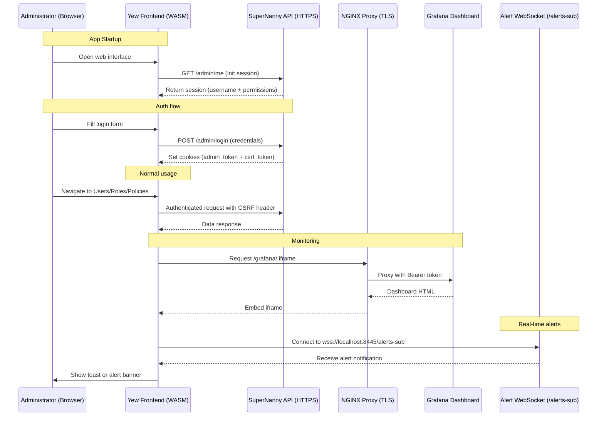

# SuperNanny Frontend

The **SuperNanny Frontend** is a secure, single-page admin interface built with [Yew](https://yew.rs), compiled to WebAssembly (Wasm). It allows administrators to manage users, roles, system rules, and monitor real-time logs through an embedded Grafana dashboard. The frontend communicates exclusively with the SuperNanny API over HTTPS and enforces CSRF and permission-based access control.

---

## Overview

* **Language & Framework**: Rust (Yew + Wasm)
* **Routing**: Client-side with `yew_router`
* **HTTPS**: All requests use fetch via gloo_net, secured over TLS (HTTPS)
* **Security**: JWT + CSRF cookies, same-origin HTTPS
* **Deployment**: Built statically and served via a TLS-enabled static server

---

## Features

* Single-page WebAssembly frontend (SPA)
* Login with CSRF-protected cookies
* Role-based permission gating using `<Guard>` components
* Real-time log alerts via WebSocket
* Embedded dashboard (Grafana via NGINX reverse proxy)

---

## Pages

The frontend exposes four core views beyond the login screen, each gated by permission:

### Users Page (`/manage_users`)

* Lists all registered users.
* Admins can create new users by assigning them a role.
* Delete actions are protected via CSRF and confirmation modals.
* Requires `view_users` permission.

### Roles Page (`/maange_roles`)

* Displays available roles and their associated permissions.
* Admins can assign or revoke permissions from roles.
* Also shows the **default policy** associated with each role.
* Requires `view_roles` permission.

### Rules Page (`/configurations`)

* Visual interface to the system enforcement layer.
* Shows runtime rules applied to applications (file access, network, etc.).
* Supports rule creation, modification, and deletion.
* Requires `view_policies` permission.

### Dashboard Page (`/dashboard`)

* Embedded Grafana dashboard via iframe (`/grafana/`).
* Displays live metrics, logs, and event filters.
* Bearer token is injected by NGINX for secure embedding.
* Requires `view_dashboard` permission.

---

## Authentication Flow

1. `POST /admin/login` to the API sets:

   * `admin_token` (HttpOnly JWT cookie)
   * `csrf_token` (non-JS-accessible cookie)
2. Client retrieves `/admin/me` on startup to initialize session.
3. All mutating requests (`POST`, `PUT`, `DELETE`) must include the `X-CSRF-Token` header, automatically injected by fetch helpers.

---

## HTTP Layer

* All requests are wrapped via helper functions:

  * `fetch_json()` – for sending and decoding JSON responses
  * `fetch_empty()` – for empty responses (204 No Content)
* Headers include cookies and `X-CSRF-Token` where needed.

---

## Reverse Proxy & Real-Time Monitoring (NGINX)

This section describes all the secure infrastructure behind the frontend, including the TLS-enabled reverse proxy, real-time alert delivery, and dashboard visualization.

---

### TLS Proxying with NGINX

The `supernanny.conf` file defines the NGINX configuration:

* **HTTPS on port `8445`**, using a self-signed TLS certificate
* **Reverse proxy** for:

  * `/grafana/` → local Grafana instance (port `3000`)
  * `/alerts-publish` → API webhook for pushing alerts
  * `/alerts-sub` → WebSocket (via [Nchan](https://nchan.io/)) for real-time client subscriptions
* **Bearer token injection** in requests to Grafana to ensure secure read-only access

---

### Real-Time Alerts

* The frontend connects to `wss://127.0.0.1:8445/alerts-sub`
* Powered by **Nchan** behind NGINX for push-based updates
* Grafana triggers alerts which are POSTed to `/alerts-publish`
* Frontend receives alert events and displays them as:

  * Toast notifications
  * Overlay banners or popups

This enables immediate feedback to administrators on suspicious or denied activity.

---

### Embedded Grafana Dashboard

* Displayed via an iframe at `/grafana/` inside the frontend UI
* All traffic is routed through NGINX for encryption and access control
* Features include:

  * 4 panels for log visualization
  * Live filtering and query support
  * Visual overlays for event types
* Grafana is **never exposed directly** — access is fully proxied and protected

---

## Sequence Diagram – Frontend Flow



---

## Project Structure

```
frontend/
├── src/
│   ├── components/       # Guard, Navbar, Toasts, reusable UI elements
│   ├── pages/            # Main views: Users, Roles, Dashboard, Alerts
│   ├── router.rs         # SPA routes and access control guards
│   ├── session.rs        # Session context & current user info
│   ├── http.rs           # fetch_json, fetch_empty, request utils
│   ├── static/           # index.html template used by Trunk
│   └── main.rs           # Yew app entry point
├── Trunk.toml            # Configuration for Trunk bundler
├── static_server/        # HTTPS static file server with Actix-Files
├── src-tauri/            # (Unused) Initial integration for desktop via Tauri
├── supernanny.conf       # NGINX reverse proxy config for TLS/Grafana/alerts
└── README.md             # You are here
```

---

## Tech Stack

* **Rust**: For frontend + backend
* **Yew**: WebAssembly-based UI
* **Trunk**: Build system for Rust+Wasm
* **gloo\_net**: Async fetch and WebSocket
* **serde / wasm-bindgen**: JSON handling and JS bindings
* **log**: Debug logging in the browser
* **NGINX + Nchan**: TLS proxy, alert stream

---

## Build & Deployment

### Local Development

In the `frontend/` directory:

```bash
trunk serve
```

This starts a local development server with hot-reload and live recompilation for testing the Yew app in-browser.

---

### Production Build

In the `frontend/` directory:

```bash
trunk build --release
```

This generates a static `dist/` folder containing the optimized WebAssembly and HTML assets.

---

### Serve Frontend over HTTPS

In the `static_server/` directory:

```bash
cargo run
```

This runs an Actix-Web static file server using TLS (via rustls) to serve the `dist/` folder over `https://localhost:8443`.

---

### Set Up NGINX Reverse Proxy (Optional for Full Integration)

To enable real-time alerts and embedded dashboards, NGINX must be installed and configured to serve as a secure reverse proxy for both Grafana and the WebSocket layer.

#### 1. Install NGINX

```bash
sudo apt update
sudo apt install nginx
```

#### 2. Copy the Configuration

Copy the `supernanny.conf` file (included in this repo) into the system configuration path:

```bash
sudo cp supernanny.conf /etc/nginx/sites-available/supernanny.conf
sudo ln -s /etc/nginx/sites-available/supernanny.conf /etc/nginx/sites-enabled/supernanny.conf
```

#### 3. Test the Configuration

Check that the NGINX config is valid:

```bash
sudo nginx -t
```

If everything is OK:

```bash
sudo systemctl restart nginx
```

This will launch NGINX listening on port `8445` with TLS enabled, and set up the proxy for:

* `/grafana/` → internal Grafana UI
* `/alerts-publish` → alert push endpoint
* `/alerts-sub` → real-time alert stream (WebSocket)

---

### Token Injection Note

The reverse proxy is configured to inject a **static Bearer token** when accessing Grafana via iframe. This token must match the one expected by Grafana's auth mechanism.

> **Note**: The current deployment uses a static token hardcoded in the NGINX config. This works only if Grafana is properly set up to accept it.
> For now, **Grafana is not deployed**, so dashboard and alerts are mocked or disabled.

---

## Contact

For questions, bugs or integration issues, contact the SuperNanny team.
