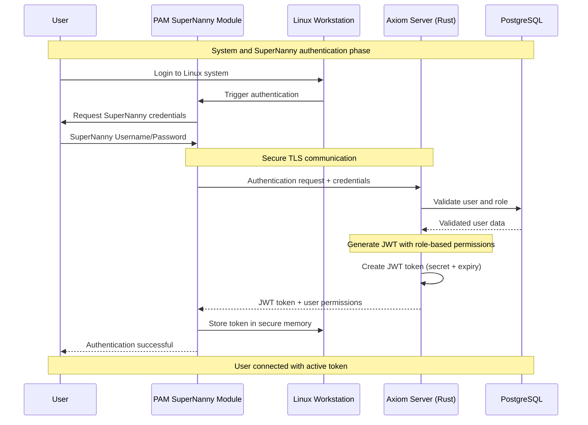
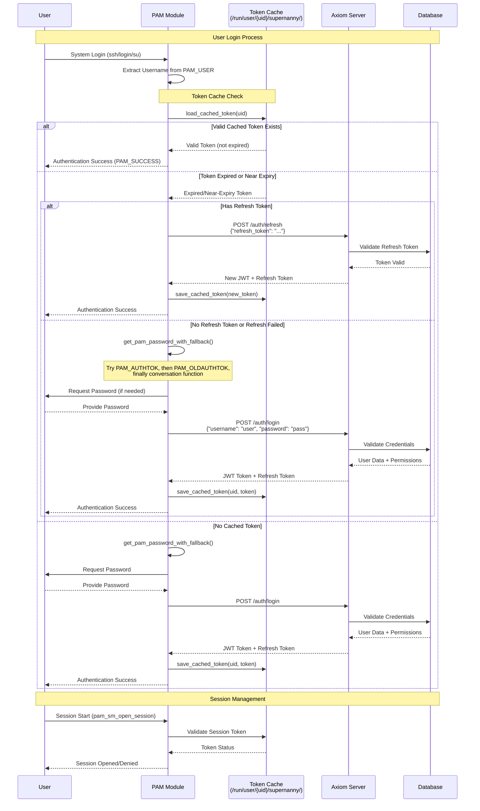
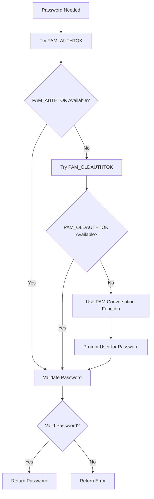

# SuperNanny PAM Module - Technical Documentation

## Overview

The SuperNanny PAM (Pluggable Authentication Modules) module is a Rust-based authentication library that seamlessly integrates into the Linux authentication flow. It extends standard user authentication by simultaneously authenticating users with the SuperNanny Axiom server to retrieve security tokens and permissions for application sandboxing.

---

## Architecture & Integration

```
┌─────────────────────────────────────────────────────────────────┐
│                        Linux System                             │
│  ┌─────────────────┐    ┌─────────────────────────────────────┐ │
│  │   User Login    │───▶│        PAM Stack                    │ │
│  │   (ssh/login)   │    │  ┌─────────────────────────────────┐│ │
│  └─────────────────┘    │  │    pam_supernanny.so            ││ │
│                          │  │  (SuperNanny PAM Module)       ││ │
│                          │  └─────────────────────────────────┘│ │
│                          └─────────────────────────────────────┘ │
└─────────────────────────────────────────────────────────────────┘
                                      │
                                      ▼ HTTPS/TLS
┌─────────────────────────────────────────────────────────────────┐
│                      Axiom Server                               │
│  ┌─────────────────┐  ┌─────────────────┐  ┌─────────────────┐ │
│  │   /auth/login   │  │   /auth/refresh │  │   Token Mgmt    │ │
│  │   Endpoint      │  │   Endpoint      │  │   Service       │ │
│  └─────────────────┘  └─────────────────┘  └─────────────────┘ │
└─────────────────────────────────────────────────────────────────┘
```

## PAM Flow


---

## Core Dependencies & Crates

### Essential Crates
```toml
[dependencies]
# PAM System Integration
pam_sys = "1.0"                    # Low-level PAM bindings
libc = "0.2"                       # C library bindings

# HTTP Client & Serialization
reqwest = { version = "0.11", features = ["json", "blocking"] }
serde = { version = "1.0", features = ["derive"] }
serde_json = "1.0"

# Security & Memory Management
zeroize = "1.6"                    # Secure memory clearing
anyhow = "1.0"                     # Error handling
```

### Key Crate Functions

#### `pam_sys` Integration
- **`pam_get_item()`**: Retrieves PAM data items (username, passwords, conversation function)
- **PAM Constants**: `PAM_USER`, `PAM_AUTHTOK`, `PAM_OLDAUTHTOK`, `PAM_CONV`
- **Return Codes**: PAM success/failure status codes

#### `reqwest` HTTP Client
- **Blocking Client**: Synchronous HTTP requests to Axiom server
- **TLS Configuration**: `danger_accept_invalid_certs(true)` for development
- **JSON Handling**: Automatic serialization/deserialization
- **Timeout Management**: 10-second request timeout

#### `zeroize` Security
- **Memory Clearing**: Automatically zeros sensitive data on drop
- **Trait Implementation**: Custom `Drop` trait for `CachedToken`

---

## PAM Module Implementation

### Entry Points (FFI Functions)

The PAM module implements the standard PAM service module interface:

```rust
#[no_mangle]
pub unsafe extern "C" fn pam_sm_authenticate(
    pamh: *mut PamHandle,
    _flags: i32,
    argc: i32,
    argv: *const *const c_char,
) -> i32 {
    let args = parse_pam_args(argc, argv);
    match handle_authenticate(pamh, &args) {
        Ok(_) => 0,  // PAM_SUCCESS
        Err(_) => 7, // PAM_AUTH_ERR
    }
}

#[no_mangle]
pub unsafe extern "C" fn pam_sm_setcred(
    _pamh: *mut PamHandle,
    _flags: i32,
    _argc: i32,
    _argv: *const *const c_char,
) -> i32 {
    0 // PAM_SUCCESS - minimal implementation
}

#[no_mangle]
pub unsafe extern "C" fn pam_sm_open_session(
    pamh: *mut PamHandle,
    _flags: i32,
    _argc: i32,
    _argv: *const *const c_char,
) -> i32 {
    match handle_session_open(pamh) {
        Ok(_) => 0,  // PAM_SUCCESS
        Err(_) => 12, // PAM_SESSION_ERR
    }
}

#[no_mangle]
pub unsafe extern "C" fn pam_sm_close_session(
    _pamh: *mut PamHandle,
    _flags: i32,
    _argc: i32,
    _argv: *const *const c_char,
) -> i32 {
    0 // PAM_SUCCESS
}
```

### Token Management System

#### Token Structure
```rust
#[derive(Serialize, Deserialize, Clone)]
struct CachedToken {
    token: String,                    // JWT token from Axiom server
    username: String,                 // Associated username
    expires_at: u64,                  // Expiration timestamp (Unix)
    #[serde(skip_serializing_if = "Option::is_none")]
    refresh_token: Option<String>,    // Optional refresh token
}

impl CachedToken {
    fn new(token: String, username: String, refresh_token: Option<String>) -> Self {
        let expires_at = SystemTime::now()
            .duration_since(UNIX_EPOCH)
            .unwrap()
            .as_secs() + TOKEN_VALIDITY_HOURS * 3600;  // 8 hours TTL
        Self { token, username, expires_at, refresh_token }
    }

    fn is_expired(&self) -> bool {
        SystemTime::now().duration_since(UNIX_EPOCH).unwrap().as_secs() >= self.expires_at
    }

    fn is_near_expiry(&self) -> bool {
        let now = SystemTime::now().duration_since(UNIX_EPOCH).unwrap().as_secs();
        (self.expires_at - now) < 1800 // 30 minutes before expiry
    }
}
```

#### Secure Memory Management
```rust
impl Drop for CachedToken {
    fn drop(&mut self) {
        self.token.zeroize();                    // Clear token from memory
        if let Some(ref mut refresh) = self.refresh_token {
            refresh.zeroize();                   // Clear refresh token
        }
    }
}
```

---

## Authentication Flow with Axiom Server

### Complete Authentication Sequence



### HTTP Communication Details

#### Login Request
```rust
fn authenticate_with_server(username: &str, password: &str) -> Result<CachedToken> {
    let url = std::env::var("SUPERNANNY_SERVER_URL")
        .unwrap_or_else(|_| "https://127.0.0.1:8443".into());
    
    let client = Client::builder()
        .danger_accept_invalid_certs(true)      // Development mode
        .timeout(std::time::Duration::from_secs(10))
        .build()?;
    
    let payload = serde_json::json!({
        "username": username,
        "password": password
    });
    
    let resp = client.post(&format!("{}/auth/login", url))
        .json(&payload)
        .send()?;
    
    if !resp.status().is_success() {
        return Err(anyhow!("Authentication failed: {}", resp.status()));
    }
    
    let lr: LoginResponse = resp.json()?;
    Ok(CachedToken::new(lr.token, username.to_string(), lr.refresh_token))
}
```

#### Token Refresh Request
```rust
fn refresh_auth_token(rt: &str, username: &str) -> Result<CachedToken> {
    let url = std::env::var("SUPERNANNY_SERVER_URL")
        .unwrap_or_else(|_| "https://127.0.0.1:8443".into());
    
    let client = Client::builder()
        .danger_accept_invalid_certs(true)
        .timeout(std::time::Duration::from_secs(10))
        .build()?;
    
    let resp = client.post(&format!("{}/auth/refresh", url))
        .json(&serde_json::json!({ "refresh_token": rt }))
        .send()?;
    
    if !resp.status().is_success() {
        return Err(anyhow!("Token refresh failed"));
    }
    
    let lr: LoginResponse = resp.json()?;
    Ok(CachedToken::new(lr.token, username.to_string(), lr.refresh_token))
}
```

---

## Password Acquisition Strategy

The PAM module implements a sophisticated fallback mechanism for obtaining user passwords:

### Password Acquisition Flow


### Implementation Details
```rust
fn get_pam_password_with_fallback(pamh: *mut PamHandle) -> Result<String> {
    // Try PAM_AUTHTOK first (current password)
    if let Ok(password) = get_pam_authtok(pamh) {
        return Ok(password);
    }
    
    // Fallback to PAM_OLDAUTHTOK (previous password)
    unsafe {
        let mut ptr: *const c_char = std::ptr::null();
        let r = pam_sys::raw::pam_get_item(pamh, PAM_OLDAUTHTOK, 
                                           &mut ptr as *mut _ as *mut *const c_void);
        
        if r == 0 && !ptr.is_null() {
            if let Ok(cstr) = CStr::from_ptr(ptr).to_str() {
                if !cstr.is_empty() && cstr.len() < 1024 {
                    return Ok(cstr.to_string());
                }
            }
        }
    }
    
    Err(anyhow!("No password available in PAM tokens"))
}

fn get_password_via_conversation(pamh: *mut PamHandle) -> Result<String> {
    unsafe {
        // Get PAM conversation function
        let mut conv_ptr: *const c_void = std::ptr::null();
        let result = pam_sys::raw::pam_get_item(pamh, PAM_CONV, 
                                               &mut conv_ptr as *mut *const c_void);
        
        if result != 0 || conv_ptr.is_null() {
            return Err(anyhow!("PAM_CONV unavailable"));
        }
        
        let conv = &*(conv_ptr as *const PamConv);
        let prompt = CString::new("Password: ").unwrap();
        
        // Create PAM message
        let msg = PamMessage { 
            msg_style: PAM_PROMPT_ECHO_OFF,  // Don't echo password
            msg: prompt.as_ptr() 
        };
        
        let msg_ptr = &msg as *const PamMessage;
        let mut resp_ptr: *mut PamResponse = std::ptr::null_mut();
        
        // Call conversation function
        let result = (conv.conv)(1, 
                                &msg_ptr as *const _ as *mut *const PamMessage, 
                                &mut resp_ptr, 
                                conv.appdata_ptr);
        
        if result != 0 || resp_ptr.is_null() {
            return Err(anyhow!("Conversation failed"));
        }
        
        // Extract password from response
        let resp = &*resp_ptr;
        if resp.resp.is_null() {
            libc::free(resp_ptr as *mut c_void);
            return Err(anyhow!("Empty password response"));
        }
        
        let password_bytes = CStr::from_ptr(resp.resp).to_bytes();
        let password = match std::str::from_utf8(password_bytes) {
            Ok(s) => s.to_string(),
            Err(_) => password_bytes.iter().map(|&b| b as char).collect()
        };
        
        // Clean up allocated memory
        libc::free(resp.resp as *mut c_void);
        libc::free(resp_ptr as *mut c_void);
        
        if password.is_empty() {
            return Err(anyhow!("Empty password"));
        }
        
        Ok(password)
    }
}
```

---

## File System Security & Token Storage

### Secure Token Storage
```rust
const TOKEN_CACHE_DIR: &str = "supernanny";
const TOKEN_CACHE_FILE: &str = "session.cache";

fn get_cache_dir_path(uid: u32) -> PathBuf {
    PathBuf::from(format!("/run/user/{}/{}", uid, TOKEN_CACHE_DIR))
}

fn save_cached_token(uid: u32, token: &CachedToken) -> Result<()> {
    let dir = get_cache_dir_path(uid);
    fs::create_dir_all(&dir)?;
    
    // Set directory permissions to 0o700 (owner only)
    fs::set_permissions(&dir, fs::Permissions::from_mode(0o700))?;
    
    let file = get_cache_file_path(uid);
    let mut f = OpenOptions::new()
        .create(true)
        .write(true)
        .truncate(true)
        .mode(0o600)    // File readable/writable by owner only
        .open(&file)?;
    
    f.write_all(serde_json::to_string_pretty(token)?.as_bytes())?;
    Ok(())
}
```

### Security Features
- **User-Specific Storage**: `/run/user/{uid}/supernanny/session.cache`
- **Restrictive Permissions**: 0o700 for directory, 0o600 for files
- **Memory Safety**: Automatic zeroization of sensitive data
- **Temporary Storage**: Uses `/run/user/` (tmpfs) for automatic cleanup on reboot

---

## Integration with Axiom Server

### Server Endpoints
- **`POST /auth/login`**: Initial authentication with username/password
- **`POST /auth/refresh`**: Token refresh using refresh token
- **Response Format**: JSON with `token` and optional `refresh_token`

### Environment Configuration
```bash
# Axiom server URL (defaults to https://127.0.0.1:8443)
export SUPERNANNY_SERVER_URL="https://your-axiom-server:8443"

# Token validity period in hours (defaults to 8)
export TOKEN_VALIDITY_HOURS="8"
```

### TLS Configuration
```rust
let client = Client::builder()
    .danger_accept_invalid_certs(true)        // For development/self-signed certs
    .timeout(std::time::Duration::from_secs(10))
    .build()?;
```

---

## Installation & Configuration

### Building the PAM Module
```bash
# Build the PAM module
cargo build --release --lib

# The resulting library will be at:
# target/release/libpam_supernanny.so
```

### PAM Configuration
```bash
# Install the PAM module
sudo cp target/release/libpam_supernanny.so /lib/security/

# Configure PAM (example for common-auth)
echo "auth required /lib/security/libpam_supernanny.so" | sudo tee -a /etc/pam.d/common-auth

# Optional: Configure arguments
echo "auth required /lib/security/libpam_supernanny.so use_first_pass" | sudo tee -a /etc/pam.d/sshd
```

### PAM Module Arguments
- **`use_first_pass`**: Use password from previous PAM module instead of prompting

---

## Error Handling & Logging

### Comprehensive Error Handling
```rust
fn handle_authenticate(pamh: *mut PamHandle, args: &[String]) -> Result<()> {
    let username = get_pam_user(pamh)
        .map_err(|e| anyhow!("Failed to get username: {}", e))?;
    
    let uid = get_user_uid(&username)
        .map_err(|e| anyhow!("Failed to get UID for {}: {}", username, e))?;
    
    // Token cache check with fallback to authentication
    if let Ok(cached) = load_cached_token(uid) {
        if !cached.is_expired() && cached.username == username {
            return Ok(());
        }
        
        // Attempt token refresh
        if cached.is_near_expiry() {
            if let Some(rt) = &cached.refresh_token {
                if let Ok(new) = refresh_auth_token(rt, &username) {
                    save_cached_token(uid, &new)?;
                    return Ok(());
                }
            }
        }
    }
    
    // Full authentication required
    let password = get_pam_password_with_fallback(pamh)
        .or_else(|_| get_password_via_conversation(pamh))?;
    
    let token = authenticate_with_server(&username, &password)?;
    save_cached_token(uid, &token)?;
    
    Ok(())
}
```

This PAM module provides seamless integration between Linux authentication and the SuperNanny security system, handling token management, secure storage, and fallback authentication mechanisms while maintaining security best practices.
