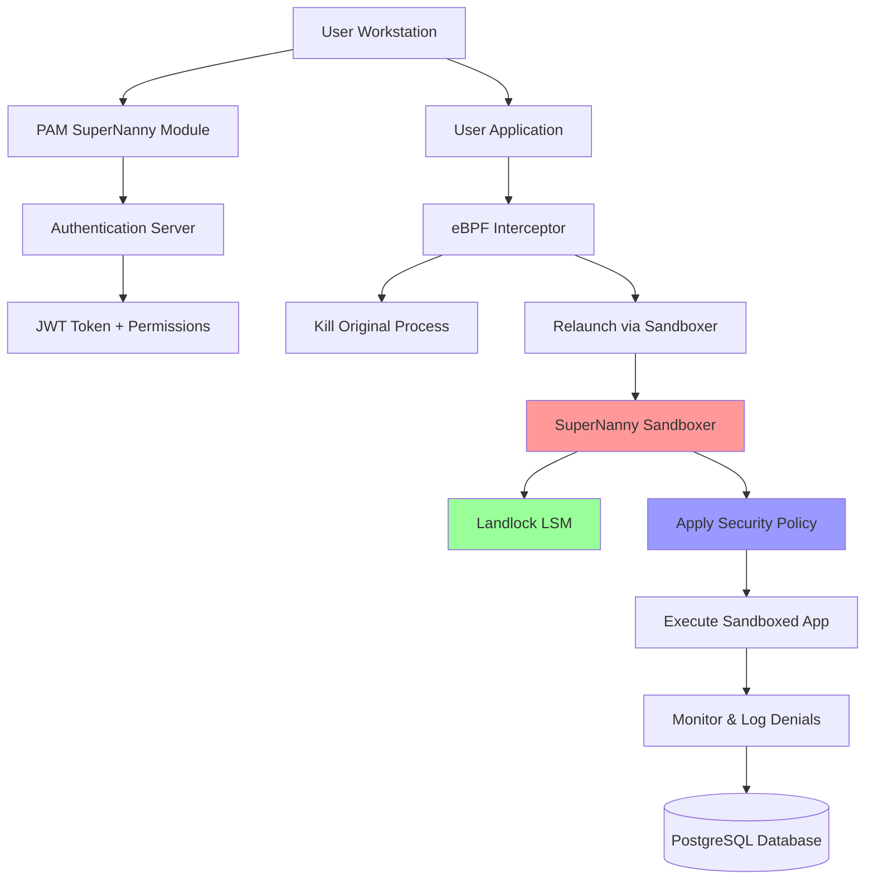
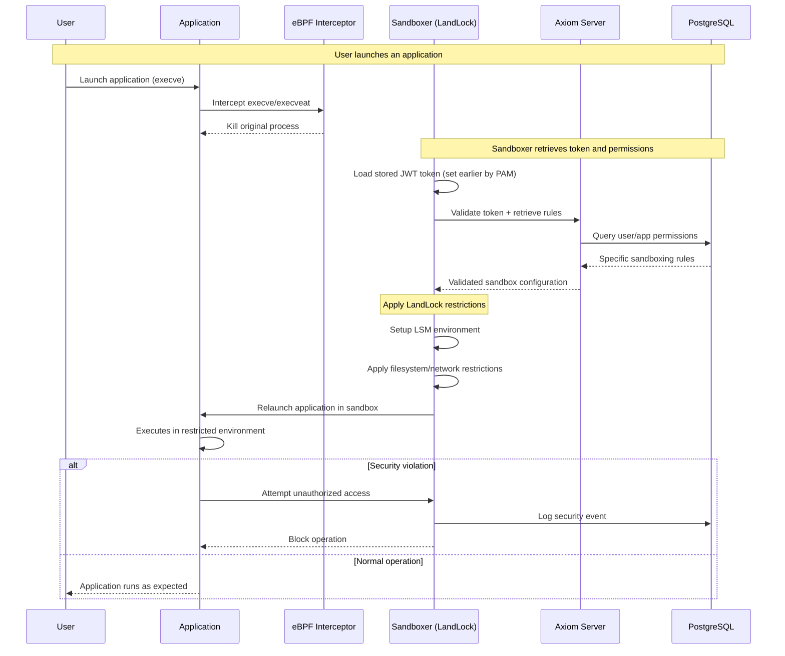
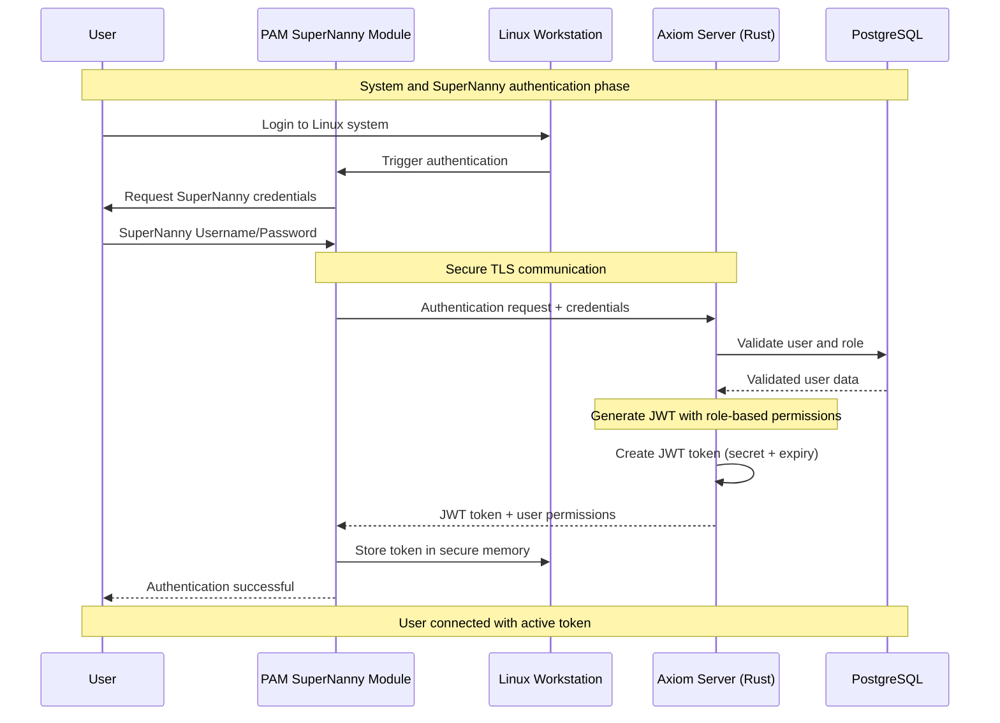

# SuperNanny Sandboxer Module

## Overview

The SuperNanny Sandboxer is a critical security component of the SuperNanny project developed by ISEN Méditerranée students. This module implements application sandboxing on Linux workstations using Rust and the Landlock LSM (Linux Security Module) to create secure execution environments for user applications.

## Architecture Overview



## Core Components

### 1. Authentication Integration
- **PAM Token Cache**: Integrates with PAM module to retrieve cached authentication tokens
- **Token Refresh**: Automatically refreshes tokens nearing expiration
- **Permission Verification**: Validates user permissions against the Axiom server

### 2. Policy Management
The sandboxer implements comprehensive security policies including:
- **Filesystem Access**: Read-only and read-write path restrictions
- **Network Access**: TCP bind/connect port controls
- **IP/Domain Filtering**: Allowed IP addresses and domain names
- **Resource Limits**: Configurable limits to prevent policy expansion attacks

### 3. Landlock Enforcement
- **LSM Integration**: Uses Landlock Linux Security Module for kernel-level enforcement
- **Ruleset Creation**: Dynamically creates Landlock rulesets based on application policies
- **Access Control**: Enforces filesystem and network access restrictions at the kernel level

### 4. Dynamic Policy Learning
- **Strace Integration**: Uses strace to monitor application behavior and detect access denials
- **Interactive Policy Updates**: Allows users to approve/deny new resource access requests
- **Server Synchronization**: Submits policy updates to the Axiom server for admin approval

## Sequence Diagrams

### Application Launch Sequence



### Authentication Flow



## Key Features

### Security Policies
```rust
pub struct AppPolicy {
    ro_paths: HashSet<PathBuf>,      // Read-only filesystem paths
    rw_paths: HashSet<PathBuf>,      // Read-write filesystem paths
    tcp_bind: HashSet<u16>,          // Allowed TCP bind ports
    tcp_connect: HashSet<u16>,       // Allowed TCP connect ports
    allowed_ips: HashSet<String>,    // Permitted IP addresses
    allowed_domains: HashSet<String>, // Permitted domain names
}
```

### Resource Limits
- **Max Read-Only Paths**: 100
- **Max Read-Write Paths**: 50
- **Max TCP Bind Ports**: 20
- **Max TCP Connect Ports**: 30
- **Max Allowed IPs**: 50
- **Max Allowed Domains**: 50

### Access Denial Handling
1. **Detection**: Uses strace to monitor system calls and detect EACCES/EPERM errors
2. **Parsing**: Extracts denied resources (paths, ports, IPs, domains) from strace logs
3. **User Interaction**: Presents approval dialogs for new resource access
4. **Policy Updates**: Submits approved changes to the Axiom server for admin review

## Technical Implementation

### Landlock Integration
The sandboxer creates Landlock rulesets with the following access controls:
- **Filesystem**: `AccessFs::from_read()` and `AccessFs::from_all()` for RO/RW paths
- **Network**: `AccessNet::BindTcp` and `AccessNet::ConnectTcp` for port restrictions

### Error Handling
- **Path Validation**: Prevents path traversal attacks and validates path lengths
- **Canonical Paths**: Resolves symbolic links and relative paths
- **Graceful Degradation**: Continues operation when non-critical errors occur

### Security Considerations
- **Token Security**: Tokens are zeroized from memory after use
- **Path Sanitization**: All paths are validated and canonicalized
- **Resource Limits**: Prevents policy expansion attacks through configurable limits
- **Privilege Separation**: Runs with minimal required privileges

## Usage

### Running Applications
```bash
# Standard usage
./sandboxer /path/to/application [args...]

# Interactive authentication fallback
./sandboxer --interactive-auth /path/to/application [args...]
```

### Sandbox Mode (Internal)
```bash
# Called automatically by strace
./sandboxer --sandbox /path/to/application [args...]
```

## Integration with SuperNanny Ecosystem

The sandboxer integrates seamlessly with other SuperNanny components:
- **PAM Module**: Retrieves authentication tokens and user permissions
- **eBPF Interceptor**: Receives application launch requests
- **Axiom Server**: Fetches policies and submits updates
- **PostgreSQL Database**: Logs denial events and policy changes
- **Admin Panel**: Enables policy management and monitoring

This modular design ensures secure, scalable, and manageable application sandboxing across the entire SuperNanny infrastructure.
